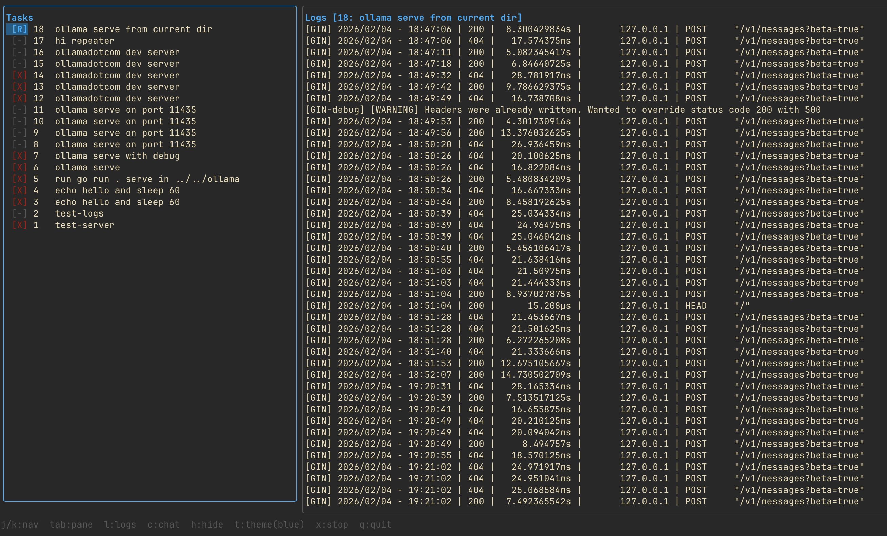

# watchy 👀


Background task manager with a TUI and an LLM agent that can read logs, run diagnostics, and start/stop tasks on your behalf.

Uses Ollama for inference. The agent sees all your tasks and their log files, and has tools to read files, run shell commands, and manage tasks.



## Install

```
go install github.com/parth/watchy/cmd/watchy@latest
```

Requires [Ollama](https://ollama.com). Recommended models:

- `glm-4.7:cloud` -- default, runs via Ollama cloud
- `glm-4.7-flash` -- runs fully local

## Usage

Run `watchy` to open the TUI. Left pane shows tasks, right pane shows logs or chat.

```
watchy                              # launch TUI
watchy --model llama3.1:8b          # launch TUI with a different model
watchy start 'make serve'           # start a background task
watchy start 'npm test' --name ci   # start with a custom name
watchy stop 3                       # stop task 3
watchy list                         # list all tasks
watchy logs 3 -n 100                # last 100 lines of task 3
watchy ask 3 "any errors?"          # ask the agent about task 3
watchy cleanup                      # remove old finished tasks
```

The `--model` flag works with any command.

## TUI keybindings

```
j/k         navigate task list
tab         switch pane
l           show logs for selected task
c           open chat (focuses input immediately)
x           stop selected task
esc         cancel in-flight agent request
q           quit
ctrl+c      quit (works even in chat input)
```

The chat pane shows tool calls as they happen -- you see what the agent is doing before it executes. You can ask follow-up questions; the conversation persists for the session.

## Chat commands

```
/model              show current model
/model llama3.1:8b  switch model mid-session
```

## Agent tools

The agent has access to:

- `read_file` -- read any file by path
- `bash_command` -- run read-only shell commands (grep, tail, head, awk, sed, wc, cat, sort, uniq, cut)
- `get_task_info` -- get task metadata
- `start_task` -- start a new background task
- `stop_task` -- stop a running task

Ask it things like "start a web server on port 8080", "are there any errors in task 2?", or "grep for panics across all logs".

## Config

Optional config at `~/.watchy/config.yaml`:

```yaml
retention_days: 1
model: "glm-4.7:cloud"
```

You can also set the model per-session with `--model` or `/model` in chat. Config file values are used as defaults.

Data lives in `~/.watchy/` (SQLite db + log files).
