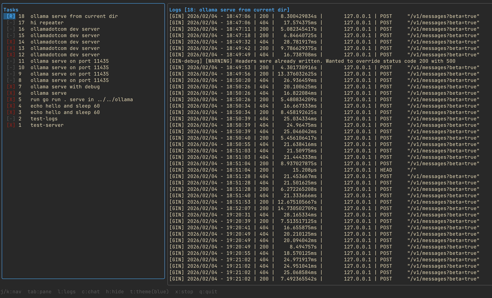

# watchy 👀


Background task manager with a TUI and an LLM agent that can read logs, run diagnostics, and start/stop tasks on your behalf.

Uses Ollama for inference. The agent sees all your tasks and their log files, and has tools to read files, run shell commands, and manage tasks.



## Install

```
go install github.com/parth/watchy/cmd/watchy@latest
```

Requires [Ollama](https://ollama.com). Recommended models:

- `glm-5.2:cloud` -- default, runs via Ollama cloud
- `glm-4.7-flash` -- runs fully local

## Usage

Run `watchy` to open the TUI. Left pane shows tasks, right pane shows logs or chat.

```
watchy                              # launch TUI
watchy --online                     # launch TUI using ollama.com cloud
watchy --model llama3.1:8b          # launch TUI with a different model
watchy --version                    # print version
watchy start 'make serve'           # start a background task
watchy run 'make serve'             # same as watchy start
watchy start 'npm test' --name ci   # start with a custom name
watchy stop 3                       # stop task 3
watchy list                         # list all tasks
watchy logs 3 -n 100                # last 100 lines of task 3
watchy ask 3 "any errors?"          # ask the agent about task 3
watchy cleanup                      # remove old finished tasks
```

The `--model` flag works with any command.

## TUI keybindings

### Navigation
```
j/k or ↑/↓   navigate task list / scroll focused pane
g            go to top of logs/chat
G            go to bottom of logs/chat
tab          move focus through the panes currently on screen
shift+tab    move focus backward
l            show logs
c            show chat
s            toggle split view
[/]          cycle logs, chat, and split views
h            hide/show sidebar
enter        open task logs / toggle task sidebar from logs / focus or send chat
?            show all keybindings
```

Mouse is supported in the TUI: click panes to focus them, click tasks to open
logs, click the chat composer to type, and use the wheel over tasks/logs/chat.

### Logs
```
l            show logs for selected task
/            search in logs
n            next search match
N            previous search match
u            show/hide routine Ollama serve noise
v            toggle visual mode (select lines with cursor)
y            copy to clipboard (selection in visual mode, or all logs)
```

### Tasks
```
x            stop selected task
r            restart stopped/crashed task
d            show full task details, command, and working directory
```

### Chat
```
i            focus chat composer from chat history
e            expand/collapse the latest tool card
y            copy latest tool args/result
ctrl+left    switch from chat to logs
ctrl+j       insert newline in chat input
esc          cancel in-flight agent request
```

### Display
```
t            cycle theme (green/blue/purple/orange/pink/cyan/red/white)
m            toggle light/dark mode
M            choose an available Ollama model
```

### General
```
q            quit
ctrl+c       quit (works even in chat input)
```

## Chat commands

```
/model              open the model picker
/model llama3.1:8b  switch model mid-session
/save <name>        save last agent-started task as a tick
/save <name> <cmd>  save a command as a named tick
/new                clear chat history
```

## Agent tools

The agent has access to:

- `read_file` -- read any file by path
- `bash_command` -- run read-only shell commands (grep, tail, head, awk, sed, wc, cat, sort, uniq, cut)
- `get_task_info` -- get task metadata
- `start_task` -- start a new background task
- `stop_task` -- stop a running task

Ask it things like "start a web server on port 8080", "are there any errors in task 2?", or "grep for panics across all logs".

## Config

Optional config at `~/.watchy/config.yaml`:

```yaml
retention_days: 7
model: "glm-5.2:cloud"
theme: "green"
color_mode: "auto"
```

Available themes: `green`, `blue`, `purple`, `orange`, `pink`, `cyan`, `red`, `white`. Use `t` in the TUI to cycle through them. `color_mode` can be `auto`, `dark`, or `light`; use `m` in the TUI to toggle and persist a manual light/dark mode.

You can also set the model per-session with `--model`, `M`, or `/model` in chat.
The picker lists models from Ollama and accepts a manually typed model name. Press
Enter to use a model for the current session or Ctrl+S to save it as the default.

Tasks remember the directory they were launched from, so restarting a task uses
the same working directory. Cleanup is explicit: `watchy cleanup` removes finished
tasks older than `retention_days`; simply opening the TUI does not delete history.

Data lives in `~/.watchy/` (SQLite db + log files).
